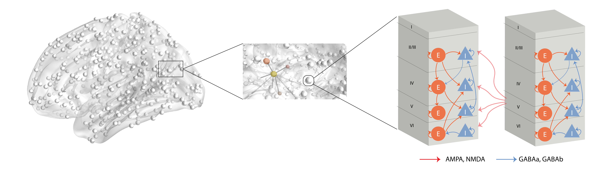

Digital_twin_brain
####################

The whole brain neuronal network model presents the computational basis of the Digital twin brain and is composed of two components: the basic computing unites and the network structure.

The basic computing units of the DTB are neurons and synapses, and the spike signal transmitted between neurons by synapses are action potentials, i.e., spikes.
Each neuron model receives the postsynaptic currents as the input and describes the generating scheme of the time points of the action potentials as the output. The synapses have different models due to the diverse neurotransmitter receptors.
The computational neuron is an integral unit of the received the presynaptic spikes from synapses as the input and generate spike trains as the output postsynaptic currents.

The network model gives the synaptic interactions between neurons by a directed multiplex graph. Structural MRI images (i.e., diffusion weighted data and T1 weighted data) from biological brains are used to indirectly and partially measure the synaptic connections from neurons to neurons or from sub-regions to sub-regions.

More detail refer to `Read docs <https://digital-twin-brain.readthedocs.io/en/master/>`_, and old code refer to
`gitlab <https://gitlab.com/lu_seminar/spliking_nn_for_brain_simulation>`_.
