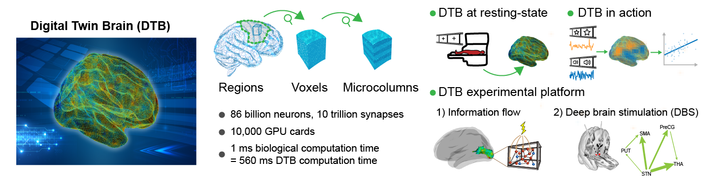

.. DTB documentation master file, created by
   sphinx-quickstart on Sun Aug  7 20:37:48 2022.
   You can adapt this file completely to your liking, but it should at least
   contain the root `toctree` directive.

Welcome to DTB's documentation!
===============================

**DTB** is a super large scale neuromorphic simulation platform.
DTB is a parallel and distributed system, which deploy ``large-scale neuronal networks`` on 10,000 GPU cards,which operates and communicates information in real time.
By optimizing the neuron layout and routing communication of cards,
we realize the 1:1 human brain simulation with a deceleration ratio of 560.
In order to model a biological-plausible brain, we develop a ``hierarchal mesoscale data assimilation (HMDA)`` method to estimate 10 trillion parameters in DTB,
which succeeds to reconstruct a cognitive brain.

The whole brain neuronal network model presents the computational basis of the Digital twin brain and is composed of two components: the basic computing unites and the network structure.

The basic computing units of the DTB are neurons and synapses, and the spike signal transmitted between neurons by synapses are action potentials, i.e., spikes.
Each neuron model receives the postsynaptic currents as the input and describes the generating scheme of the time points of the action potentials as the output. The synapses have different models due to the diverse neurotransmitter receptors.
The computational neuron is an integral unit of the received the presynaptic spikes from synapses as the input and generate spike trains as the output postsynaptic currents.

The network model gives the synaptic interactions between neurons by a directed multiplex graph. Structural MRI images (i.e., diffusion weighted data and T1 weighted data) from biological brains are used to indirectly and partially measure the synaptic connections from neurons to neurons or from sub-regions to sub-regions.

.. toctree::
   :maxdepth: 2
   :hidden:

   rstfiles/install
   rstfiles/user_guide
   modules
